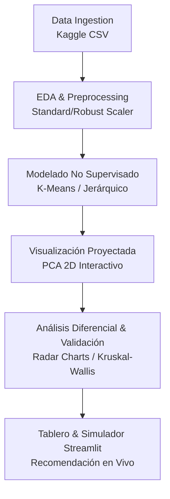

# Project Terra


> Análisis exploratorio y clustering de zonas agrícolas para la recomendación inteligente de cultivos.

**Project Terra** explora si es posible descubrir "ecorregiones funcionales" agrícolas a partir de variables de suelo y clima (N, P, K, pH, temperatura, humedad y precipitación), sin depender de fronteras políticas ni reglas empíricas. Usando técnicas de aprendizaje no supervisado (K-Means, Clustering Jerárquico, PCA), el proyecto agrupa zonas de muestreo en perfiles ambientales homogéneos y valida su coherencia agronómica contrastando los clústeres contra el cultivo real reportado en cada registro.

Proyecto del curso **Analítica y Minería de Datos** — Escuela de Transformación Digital, Universidad Tecnológica de Bolívar (UTB).

## Equipo

- Dariem Antonio García Cardona
- Jasen Mihovil Yukopila Escobar
- Carlos Miguel Toro Torres

## Objetivos

**Objetivo general:** implementar un modelo de clustering sobre un dataset de recomendación de cultivos para segmentar los registros en grupos homogéneos según sus condiciones climáticas y edáficas.

**Objetivos específicos:**
- Realizar un EDA exhaustivo (distribuciones, atípicos, correlaciones multivariantes, relaciones no lineales).
- Preprocesar y estandarizar variables (StandardScaler / RobustScaler).
- Reducir dimensionalidad con PCA para visualización y eficiencia computacional.
- Segmentar con K-Means y Clustering Jerárquico Aglomerativo, determinando K óptimo (Método del Codo, Silueta, Davies-Bouldin).
- Caracterizar cada clúster (estadísticos descriptivos, radar charts / boxplots paralelos).
- Validar coherencia agronómica contra `label` (cultivo real) y, si aplica, rendimiento (ANOVA / Kruskal-Wallis).

## Dataset

Dataset tipo *Crop Recommendation* con variables predictoras N, P, K, temperatura, humedad, pH y precipitación, más `label` (cultivo) como variable de validación post-hoc.

| Variable | Descripción | Unidad Típica |
| :--- | :--- | :--- |
| **N** | Ratio de contenido de Nitrógeno en el suelo | ppm / razón |
| **P** | Ratio de contenido de Fósforo en el suelo | ppm / razón |
| **K** | Ratio de contenido de Potasio en el suelo | ppm / razón |
| **Temperature** | Temperatura ambiente | °C |
| **Humidity** | Humedad relativa | % |
| **pH** | Valor de pH del suelo | 0-14 |
| **Rainfall** | Precipitación acumulada | mm |
| **Label** | Tipo de cultivo recomendado (Validación) | Categórica |

Fuente: [Crop Recommendation Dataset — Kaggle](https://www.kaggle.com/datasets/atharvaingle/crop-recommendation-dataset)

> El CSV original no se versiona en este repo (ver `.gitignore`). Descárgalo y colócalo en `data/raw/`.

## Estructura del repositorio

```
project-terra/
├── app/                # Aplicación interactiva de Streamlit (Demo para Feria)
│   ├── main.py         # Punto de entrada y métricas globales
│   ├── pages/          # 01 Overview, 02 Explorer, 03 Recommender (Simulador)
│   └── utils.py        # Carga de datos cacheados y modelos
├── data/
│   ├── raw/            # Dataset original (sensor_Crop_Dataset.csv)
│   ├── processed/      # Dataset escalado y enriquecido con clústeres
│   └── models/         # Modelos serializados (KMeans, StandardScaler)
├── notebooks/          # 01 EDA, 02 Preprocesamiento/PCA, 03 Clustering, 04 Profiling
├── src/                # Módulos reutilizables (clustering.py, profiling.py)
├── reports/            # Informe técnico, figuras y dashboards
├── requirements.txt
├── LICENSE
└── README.md
```

## Cómo empezar

```bash
git clone https://github.com/Dmgar/Project_Terra.git
cd project_terra
python -m venv venv
source venv/bin/activate  # Windows: venv\Scripts\activate
pip install -r requirements.txt
```

### Ejecutar la Aplicación Interactiva (Feria)

```bash
python -m streamlit run app/main.py
```

Descarga el dataset desde Kaggle y colócalo en `data/raw/sensor_Crop_Dataset.csv`.

## Metodología (fases)



- [x] 1. **Ingeniería de datos y EDA avanzado** — limpieza, correlaciones, pairplots, PCA preliminar.
- [x] 2. **Determinación del número de clústeres (K)** — codo (inercia), silueta y Davies-Bouldin.
- [x] 3. **Ejecución del clustering multivariado** — K-Means y Jerárquico sobre features escalados (PCA solo para visualización).
- [x] 4. **Análisis diferencial y validación** — perfil/firma ambiental (radar charts), análisis de `Soil_Type`, pureza y Kruskal-Wallis.
- [x] 5. **Tablero interpretativo y simulador interactivo** — aplicación Streamlit multiplataforma lista para feria.

## Entregables esperados

- Dataset enriquecido con la variable de clúster asignada.
- Informe técnico del EDA, algoritmo elegido e interpretación de perfiles.
- Dashboards/gráficos de radar comparando perfiles ambientales.
- Conclusiones prácticas y estratégicas para asignación de recursos agrícolas.

## Licencia

Este proyecto está bajo la licencia MIT — ver [LICENSE](LICENSE) para más detalles.
