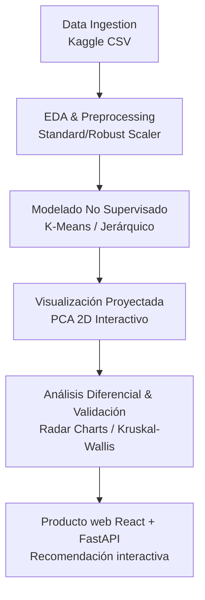

# Project Terra


> Análisis exploratorio y clustering de zonas agrícolas para la recomendación inteligente de cultivos.

**Project Terra** explora si es posible descubrir "ecorregiones funcionales" agrícolas a partir de variables de suelo y clima (N, P, K, pH, temperatura, humedad y precipitación), sin depender de fronteras políticas ni reglas empíricas. Usando técnicas de aprendizaje no supervisado (K-Means, Clustering Jerárquico, PCA), el proyecto agrupa zonas de muestreo en perfiles ambientales homogéneos y valida su coherencia agronómica contrastando los clústeres contra el cultivo real reportado en cada registro.

Proyecto del curso **Analítica y Minería de Datos** — Escuela de Transformación Digital, Universidad Tecnológica de Bolívar (UTB).

## Equipo

- Dariem Antonio García Cardona
- Jasen Mihovil Yukopila Escobar
- Carlos Miguel Toro Torres

## Objetivos

**Objetivo general:** implementar un modelo de clustering sobre un dataset de recomendación de cultivos para segmentar los registros en grupos homogéneos según sus condiciones climáticas y edáficas.

**Objetivos específicos:**
- Realizar un EDA exhaustivo (distribuciones, atípicos, correlaciones multivariantes, relaciones no lineales).
- Preprocesar y estandarizar variables (StandardScaler / RobustScaler).
- Reducir dimensionalidad con PCA para visualización y eficiencia computacional.
- Segmentar con K-Means y Clustering Jerárquico Aglomerativo, determinando K óptimo (Método del Codo, Silueta, Davies-Bouldin).
- Caracterizar cada clúster (estadísticos descriptivos, radar charts / boxplots paralelos).
- Validar coherencia agronómica contra `label` (cultivo real) y, si aplica, rendimiento (ANOVA / Kruskal-Wallis).

## Dataset

Dataset tipo *Crop Recommendation* con variables predictoras N, P, K, temperatura, humedad, pH y precipitación, más `label` (cultivo) como variable de validación post-hoc.

| Variable | Descripción | Unidad Típica |
| :--- | :--- | :--- |
| **N** | Ratio de contenido de Nitrógeno en el suelo | ppm / razón |
| **P** | Ratio de contenido de Fósforo en el suelo | ppm / razón |
| **K** | Ratio de contenido de Potasio en el suelo | ppm / razón |
| **Temperature** | Temperatura ambiente | °C |
| **Humidity** | Humedad relativa | % |
| **pH** | Valor de pH del suelo | 0-14 |
| **Rainfall** | Precipitación acumulada | mm |
| **Label** | Tipo de cultivo recomendado (Validación) | Categórica |

Fuente: [Crops NPK Data Set — Kaggle](https://www.kaggle.com/datasets/javakhan/crops-npk-data-set)

> El CSV original no se versiona en este repo (ver `.gitignore`). Descarga
> `sensor_Crop_Dataset (1).csv`, renómbralo como `sensor_Crop_Dataset.csv` y
> colócalo en `data/raw/`.

## Estructura del repositorio

```
project-terra/
├── api/                # API FastAPI para datos, regiones y predicciones
├── docs/               # Documentación (Changelog, Roadmap, Arquitectura)
├── frontend/           # Producto web React + Vite
├── app/                # Interfaz Streamlit heredada
├── data/
│   ├── raw/            # Dataset original (sensor_Crop_Dataset.csv)
│   ├── processed/      # Dataset escalado y enriquecido con clústeres
│   └── models/         # Modelos serializados (KMeans, StandardScaler)
├── notebooks/          # 01 EDA, 02 Preprocesamiento/PCA, 03 Clustering+Modelo, 04 Profiling, 05 Informe/Dashboard
├── src/                # Módulos reutilizables (clustering.py, profiling.py)
├── reports/            # Informe técnico, figuras y dashboards
├── requirements.txt
├── LICENSE
└── README.md
```

## Documentación y Seguimiento

Para llevar un control detallado del avance, lo que se hizo y lo que se realizará a futuro, consulta la carpeta [`docs/`](docs/):

- [**Changelog**](docs/CHANGELOG.md): Registro histórico de fases completadas y características implementadas.
- [**Roadmap**](docs/ROADMAP.md): Lista de tareas pendientes y próximos pasos planificados.

## Cómo empezar

```bash
git clone https://github.com/Dmgar/Project_Terra.git
cd project_terra
python -m venv venv
source venv/bin/activate  # Windows: venv\Scripts\activate
pip install -r requirements.txt
```

### Ejecutar el producto web

```bash
cd frontend && npm install && npm run build
cd .. && python -m uvicorn api.server:app --host 0.0.0.0 --port 5000
```

Descarga el dataset desde Kaggle y colócalo en `data/raw/sensor_Crop_Dataset.csv`.

## Metodología (fases)



- [x] 1. **Ingeniería de datos y EDA avanzado** — limpieza, correlaciones, pairplots, PCA preliminar. *(Completado, [`01_eda_crops_npk.ipynb`](notebooks/01_eda_crops_npk.ipynb))*
- [x] 2. **Determinación del número de clústeres (K)** — codo (inercia), silueta y Davies-Bouldin. *(Completado, [`03_clustering_model.ipynb`](notebooks/03_clustering_model.ipynb): ninguna métrica marca un K claramente óptimo — silueta baja en todo el rango (0.09–0.11) y Davies-Bouldin decrece de forma monótona; se fijó K=5 por interpretabilidad, tan arbitrario como cualquier otro K en ese rango)*
- [x] 3. **Ejecución del clustering multivariado** — K-Means y Jerárquico sobre features escalados (PCA solo para visualización). *(Completado, [`03_clustering_model.ipynb`](notebooks/03_clustering_model.ipynb) + [`src/run_pipeline.py`](src/run_pipeline.py): K-Means (K=5) y Jerárquico Aglomerativo entrenados; modelo y scaler serializados en `data/models/`)*
- [x] 4. **Análisis diferencial y validación** — perfil/firma ambiental (radar charts), análisis de `Soil_Type`, pureza y Kruskal-Wallis. *(Completado, [`04_cluster_profiling.ipynb`](notebooks/04_cluster_profiling.ipynb): con K=5 los clústeres se explican sobre todo por Humedad, pH, Precipitación y Potasio (Kruskal-Wallis H > 8,000), no por Nitrógeno/Fósforo; pureza global respecto al cultivo real = 17.50% y `Soil_Type` tampoco correlaciona — coherencia agronómica débil)*
- [x] 5. **Producto de inteligencia agronómica** — interfaz React responsive conectada a una API FastAPI, con análisis de ecorregiones y recomendación interactiva basada en el modelo real. La interfaz Streamlit original se conserva en `app/` como referencia histórica.
- [x] 6. **Planeación económica de la parcela** — optimizador de distribución por hectáreas con restricciones de área, presupuesto y agua; escenarios conservador, esperado y favorable; comparación manual y referencias editables de DANE SIPSA, UPRA/EVA y FAO CROPWAT.

> **Hallazgo clave**: con las variables disponibles (N, P, K, temperatura, humedad, pH, precipitación), el dataset no muestra una estructura de clústeres fuerte ni agronómicamente coherente para ningún K probado — ver conclusiones de `03_clustering_model.ipynb`, `04_cluster_profiling.ipynb` y `05_dashboard.ipynb` para el detalle y las alternativas propuestas (usar solo las variables con mayor poder discriminante, incorporar `Soil_Type`/`Variety`, etc.).

## Metodología económica

El **Plan rentable** usa programación lineal para maximizar la utilidad neta
esperada (`precio × rendimiento × área − costo × área`). Respeta el área,
presupuesto, agua disponible y los límites mínimos/máximos configurados para
cada cultivo. La afinidad ambiental aplica únicamente una penalización de
ordenamiento de hasta 20 %; nunca se convierte en precio, costo o rendimiento.

El catálogo incluido es una referencia versionada y disponible sin conexión.
Todos sus valores son visibles y editables. DANE SIPSA aporta contexto de
precios mayoristas, UPRA/EVA aporta contexto de producción y rendimiento, las
fichas UPRA aportan contexto de costos, y FAO-56/CROPWAT aporta la metodología
hídrica. Las cifras no son cotizaciones en tiempo real ni garantías de utilidad.

## Entregables esperados

- Dataset enriquecido con la variable de clúster asignada.
- Informe técnico del EDA, algoritmo elegido e interpretación de perfiles.
- Dashboards/gráficos de radar comparando perfiles ambientales.
- Conclusiones prácticas y estratégicas para asignación de recursos agrícolas.

## Licencia

Este proyecto está bajo la licencia MIT — ver [LICENSE](LICENSE) para más detalles.
